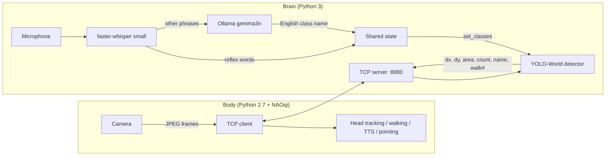

# NAO_PET: Voice- and Vision-Controlled NAO Robot

A humanoid NAO robot that listens to Spanish voice commands, infers what object you need with a local LLM, finds it with open-vocabulary vision, walks toward it and points at it.

Versión en español: [README.es.md](README.es.md)

## Problem

Classic robot demos hard-code a fixed list of objects and commands. This project explores a more natural loop: you say "I'm dying of thirst", the robot infers "bottle", searches for it, approaches it and tells you it found it.

## Approach

The system is split in two processes connected by TCP, because the robot's SDK (NAOqi) runs on Python 2.7 while the AI stack needs modern Python and, ideally, a GPU.



- **Vision (`nao_brain_v3.py`):** YOLO-World `yolov8s-worldv2` with a target class that can be switched at runtime; picks the largest box (closest object) and sends normalized offsets and area to the robot. Detection confidence threshold 0.13.
- **Hearing (`modulo_oido.py`):** faster-whisper `small` in Spanish with voice-activity filtering and a fuzzy wake-word match.
- **Intent (`modulo_cerebro.py`):** `gemma3n` served by Ollama, prompted (temperature 0) to answer with a single English object name or `null`.
- **Body (`nao_body_v4.py`):** proportional head tracking, walking toward the object until it fills about 10% of the frame (backing off if it exceeds 25%), then pointing with the right arm and speaking once.
- **Reflexes:** "ven / acércate / camina" and "para / alto / quieto" bypass the LLM for low latency. The robot starts idle for safety.

## Results

No detection success rate or end-to-end latency has been measured, and there is no demo recording in the repository.

## Tech stack

Python 3, Python 2.7 (NAOqi 2.8.6), PyTorch, Ultralytics YOLO-World, OpenCV, faster-whisper, SpeechRecognition, thefuzz, Ollama (gemma3n).

## How to run

Requirements: a NAO robot on the same network, the NAOqi Python 2.7 SDK, a PC with [Ollama](https://ollama.com) (`ollama pull gemma3n`) and ideally a CUDA GPU. The YOLO-World weights file (`yolov8s-worldv2.pt`) is git-ignored and not included in the repository. There is no `requirements.txt`; the Python 3 imports are:

```bash
pip install ultralytics opencv-python torch numpy faster-whisper SpeechRecognition pyaudio thefuzz requests
```

```bash
# PC (brain), Python 3
python nao_brain_v3.py          # waits for the NAO body to connect

# Robot side (Python 2.7 with NAOqi): edit SERVER_IP, ROBOT_IP and the SDK path in nao_body_v4.py first
python nao_body_v4.py
```

Say "ven" to walk, "para" to stop, or ask for an object to change the target.

## Project structure

```
nao_brain_v3.py     brain: vision server + voice/LLM thread
nao_body_v4.py      body: NAOqi client (Python 2.7)
modulo_oido.py      speech recognition and wake word
modulo_cerebro.py   LLM intent -> object class
modulo_vision.py    YOLO-World wrapper (not imported by nao_brain_v3.py)
```

## Limitations

- The brain's socket listens on all interfaces without authentication; use it only on a trusted network.
- The frame-size header uses `struct` format `"L"`, which is platform dependent; run brain and body on matching platforms.
- Object vocabulary hints are hard-coded in `modulo_cerebro.py`.

## Credits

Jhamil Peña ([@Jaed69](https://github.com/Jaed69)).

## License

No license file is included in this repository.
